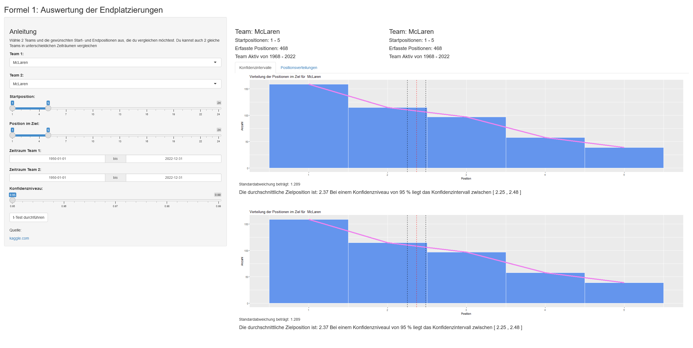

# Formula 1 Analysis Tool



## Project Description

The Formula 1 Analysis Tool is an interactive web application developed using Shiny in RStudio. It provides detailed analysis and visualizations of Formula 1 race data, allowing users to compare the performance of two teams over specified periods.

## Features

- **Team Comparison**: Select two teams to compare their performance.
- **Position Analysis**: Analyze start and end positions of races.
- **Date Range Selection**: Filter data by specific date ranges.
- **Confidence Intervals**: Calculate and display confidence intervals for end positions.
- **Statistical Testing**: Perform t-tests to compare team performances.

## Setup Instructions

To run this project locally, follow these steps:

1. **Clone the Repository**:
    ```bash
    git clone https://github.com/pvl-marci/Formula-1-Analysis-Tool.git
    cd Formula-1-Analysis-Tool
    ```

2. **Install R and RStudio**:
    Follow the instructions on the [official R website](https://cran.r-project.org/) and the [RStudio website](https://www.rstudio.com/products/rstudio/download/) to install R and RStudio.

3. **Install Required Packages**:
    Open RStudio and run the following commands to install the required packages:
    ```R
    install.packages(c("shiny", "tidyverse"))
    ```

4. **Run the Application**:
    In RStudio, open the `app.R` file and click the "Run App" button.

## Usage

### User Interface

- **Sidebar Panel**: 
  - Select two teams to compare.
  - Choose start and end positions using sliders.
  - Define date ranges for each team.
  - Set confidence levels for statistical analysis.
  - Perform t-tests to compare the selected teams.
  
- **Main Panel**: 
  - Displays team information, active years, and position distributions.
  - Generates interactive plots showing the distribution of end positions for both teams.
 
